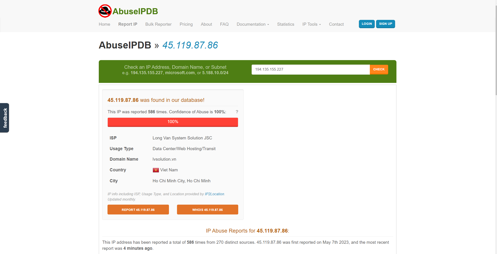

## IP_blocking
### As Cisco FTD has no functionality to block IP temporarily, I have written a Python-Flask project to temporary block IP addredd via Cisco SecureX API 

##### Here is possible to add IP address by its abusive percentage( 0-25% - 1 Hour, 25-50% - 1 day, 50-75 - 1 hour, 75-100% - 24 hour ) or you can select Auto and program will automatically define percentage via [AbuseIPDB](https://www.abuseipdb.com/).

#### Request sends to AbuseIPDB via its API and IP percentage defines automatically.

#### To achieve this you need to create workflow. Below workflow is default on Cisco SecureX platform

For the more details you can check the full documentation for the [Triggering via Threat Response API](https://ciscosecurity.github.io/sxo-05-security-workflows/workflows/response/tr-api)
